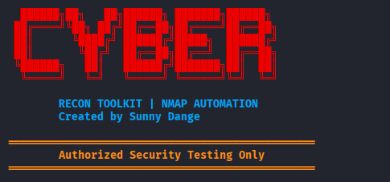
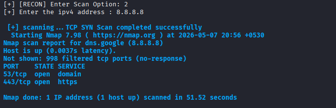
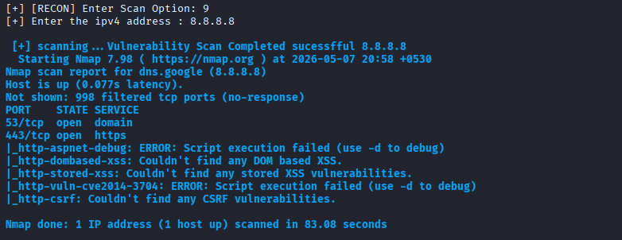
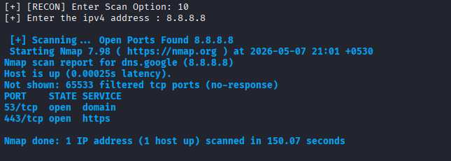

# Nmap Recon Toolkit

A Bash-based cybersecurity reconnaissance and network scanning toolkit that automates multiple Nmap scanning techniques through a menu-driven interface.

---

# 📌 Overview

The **Nmap Recon Toolkit** is a practical cybersecurity automation project developed using Bash scripting and Nmap.

This toolkit provides an interactive terminal-based interface for performing:

* Host discovery
* Network reconnaissance
* Port scanning
* Service enumeration
* OS fingerprinting
* Vulnerability assessment
* Advanced Nmap scanning techniques

The project was built as part of hands-on cybersecurity and Linux automation learning.

---

# 🚀 Features

* Interactive menu-driven interface
* Colored cybersecurity-style terminal UI
* Host discovery scanning
* TCP SYN scanning
* TCP Connect scanning
* UDP scanning
* Service version detection
* Operating system detection
* Aggressive network scanning
* Default NSE script scanning
* Vulnerability assessment scanning
* Full port scanning
* Stealth scanning
* FIN scanning
* NULL scanning
* XMAS scanning
* ACK scanning
* Window scanning
* Idle/Zombie scanning
* Fragmented packet scanning
* IPv6 scanning
* Fast scanning
* Timing template scanning
* Real-time Nmap output display
* Scan success/error handling

---

# 🛠️ Technologies Used

* Bash Scripting
* Kali Linux
* Linux Terminal
* Nmap

---

# 📂 Project Structure

```bash id="final1"
nmap-recon-toolkit/

│── nmap-recon-toolkit.sh
│── install.sh
│── dependencies.txt
│── README.md
│── screenshots/
│── reports/
```

---

# ⚙️ Dependencies

The following dependencies are required:

* Bash
* Nmap

---

# 📦 Installation

## Clone the Repository

```bash id="final2"
git clone https://github.com/DANGESUNNY20/Cybersecurity-Bash-Automation-Toolkit.git
```

---

## Navigate to Project Directory

```bash id="final3"
cd Cybersecurity-Bash-Automation-Toolkit/nmap-recon-toolkit
```

---

# 🔧 Install Dependencies

## Method 1 — Using install.sh (Recommended)

Give executable permission:

```bash id="final4"
chmod +x install.sh
```

Run installation script:

```bash id="final5"
./install.sh
```

---

## Method 2 — Manual Installation

```bash id="final6"
sudo apt update
sudo apt install nmap -y
```

---

# ▶️ Running the Toolkit

Give executable permission:

```bash id="final7"
chmod +x nmap-recon-toolkit.sh
```

Run the tool:

```bash id="final8"
./nmap-recon-toolkit.sh
```

---

# 📸 Screenshots

## 🔥 Toolkit Banner

UPLOAD IMAGE:

```bash id="final9"

```

---

## 📋 Main Menu Interface

UPLOAD IMAGE:

```bash id="final10"

```

---

## 🌐 Host Discovery Scan

UPLOAD IMAGE:

```bash id="final11"

```

---

## 🔎 TCP SYN Scan Output

UPLOAD IMAGE:

```bash id="final12"

```

---

## 🛡️ Vulnerability Assessment Scan

UPLOAD IMAGE:

```bash id="final13"

```

---

## 🚀 Full Port Scan Output

UPLOAD IMAGE:

```bash id="final14"

```

---

# 📌 Supported Scan Types

| No | Scan Type                     |
| -- | ----------------------------- |
| 1  | Host Discovery Scan           |
| 2  | TCP SYN Scan                  |
| 3  | TCP Connect Scan              |
| 4  | UDP Scan                      |
| 5  | Service Version Detection     |
| 6  | Operating System Detection    |
| 7  | Aggressive Scan               |
| 8  | Default Script Scan           |
| 9  | Vulnerability Assessment Scan |
| 10 | Full Port Scan                |
| 11 | Stealth Scan                  |
| 12 | FIN Scan                      |
| 13 | NULL Scan                     |
| 14 | XMAS Scan                     |
| 15 | ACK Scan                      |
| 16 | Window Scan                   |
| 17 | Idle Zombie Scan              |
| 18 | Fragmented Packet Scan        |
| 19 | IPv6 Scan                     |
| 20 | Fast Scan                     |
| 21 | Timing Template Scan          |

---

# 🎯 Learning Objectives

This project helped in understanding:

* Bash scripting automation
* Linux shell scripting concepts
* Conditional statements and loops
* Menu-driven scripting
* Nmap integration
* Reconnaissance workflows
* Cybersecurity tool development
* Linux-based security automation

---

# 🚀 Future Improvements

Planned future enhancements:

* Automated report generation
* PDF scan reports
* Domain resolution support
* Logging system
* Multi-target scanning
* Whois integration
* DNS enumeration
* Subdomain enumeration
* Automated recon workflows
* Scan result export options

---

# ⚠️ Disclaimer

This project is developed strictly for:

* Educational purposes
* Ethical hacking labs
* Authorized security testing
* Cybersecurity learning

Do not use this tool against systems without proper authorization.

---

# 👨‍💻 Author

## Sunny Dange

* GitHub: https://github.com/DANGESUNNY20
* LinkedIn: [www.linkedin.com/in/sunnydange](http://www.linkedin.com/in/sunnydange)

---
