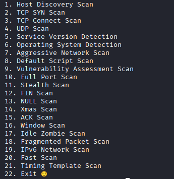
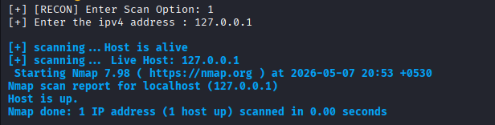

# 🔎 Nmap Recon Toolkit

<div align="center">

### 🚀 Advanced Bash-Based Cybersecurity Reconnaissance & Network Scanning Framework

A professional Linux-based cybersecurity automation toolkit that integrates multiple **Nmap reconnaissance, enumeration, and vulnerability assessment techniques** through an interactive Bash-powered terminal interface.


</div>

---

# 📌 Overview

The **Nmap Recon Toolkit** is an advanced Bash scripting project developed to automate and simplify cybersecurity reconnaissance and network scanning operations using **Nmap**.

The toolkit provides a professional menu-driven terminal interface capable of automating multiple scanning methodologies including:

* 🌐 Host Discovery
* 🔍 Network Reconnaissance
* 🚪 Port Enumeration
* 🛠️ Service Detection
* 🖥️ Operating System Fingerprinting
* 🛡️ Vulnerability Assessment
* ⚡ Advanced Stealth Scanning Techniques
* 📄 Automated Scan Report Saving
* 🎯 Multi-Scan Automation

This project was created to strengthen practical skills in:

* Linux Administration
* Bash Scripting Automation
* Network Security Testing
* Cybersecurity Reconnaissance
* Ethical Hacking Methodologies
* Security Tool Development

---

# 🚀 Core Features

# 🎨 Interactive Terminal Interface

* Professional menu-driven Bash UI
* Colored cybersecurity-themed terminal design
* Real-time scan execution output
* User-friendly navigation system
* Automated error handling
* Input validation system
* Organized scanning workflow

---

# 🌐 Reconnaissance & Enumeration Modules

## 🔍 Basic Reconnaissance

* Host Discovery Scan
* Fast Network Scan
* Ping Sweep Scanning
* Live Host Detection
* Service Version Detection
* Operating System Detection

---

## 🚪 Port Scanning Techniques

* TCP SYN Scan
* TCP Connect Scan
* UDP Scan
* Full Port Scan
* Custom Port Range Scan
* Top Ports Scan

---

## ⚡ Advanced Nmap Scanning Techniques

* Stealth Scan
* FIN Scan
* NULL Scan
* XMAS Scan
* ACK Scan
* Window Scan
* Idle/Zombie Scan
* Fragmented Packet Scan
* IPv6 Scan
* Timing Template Scan
* Aggressive Scan (`-A`)

---

# 🛡️ Security Assessment Features

* Default NSE Script Scan
* Vulnerability Assessment Scan
* Service Enumeration
* Version Enumeration
* Security Misconfiguration Detection
* Basic Vulnerability Identification

---

# 📄 Report & Output Management

## ✅ Newly Upgraded Features

* Automated scan result saving
* Organized report storage system
* Timestamp-based report generation
* Custom output file naming
* Scan logging support
* Structured terminal output

Generated reports are automatically stored inside:

```bash
reports/
```

---

# 🛠️ Technologies Used

| Technology         | Purpose                 |
| ------------------ | ----------------------- |
| 🐧 Kali Linux      | Operating Environment   |
| 💻 Bash Scripting  | Automation & Logic      |
| 🌐 Nmap            | Network Reconnaissance  |
| 🖥️ Linux Terminal | Execution Environment   |
| 📄 NSE Scripts     | Vulnerability Detection |

---

# 📂 Project Structure

```bash
Cybersecurity-Bash-Automation-Toolkit/
│
├── nmap-recon-toolkit/
│   ├── nmap-recon-toolkit.sh
│   ├── install.sh
│   ├── dependencies.txt
│   ├── README.md
│   │
│   ├── screenshots/
│   │   ├── banner.png
│   │   ├── menu-interface.png
│   │   ├── host-discovery-scan.png
│   │   ├── tcp-syn-scan.png
│   │   └── vulnerability-scan.png
│   │
│   ├── reports/
│   │   └── (saved scan outputs)
│   │
│   └── logs/
│       └── (scan activity logs)
```

---

# ⚙️ Dependencies

The following tools are required:

* Bash
* Nmap
* Linux Operating System

---

# 📦 Installation

## 1️⃣ Clone the Repository

```bash
git clone https://github.com/DANGESUNNY20/Cybersecurity-Bash-Automation-Toolkit.git
```

---

## 2️⃣ Navigate to Toolkit Directory

```bash
cd Cybersecurity-Bash-Automation-Toolkit/nmap-recon-toolkit
```

---

# 🔧 Dependency Installation

## Method 1 — Automatic Installation (Recommended)

Give executable permissions:

```bash
chmod +x install.sh
```

Run installer:

```bash
./install.sh
```

---

## Method 2 — Manual Installation

```bash
sudo apt update
sudo apt install nmap -y
```

---

# ▶️ Running the Toolkit

Give executable permissions:

```bash
chmod +x nmap-recon-toolkit.sh
```

Run the toolkit:

```bash
./nmap-recon-toolkit.sh
```

---

# 📸 Screenshots

## 🔥 Toolkit Banner


---

## 📋 Main Menu Interface



---

## 🌐 Host Discovery Scan



---

## 🔎 TCP SYN Scan Output


---

## 🛡️ Vulnerability Assessment Scan


---

## 🚀 Full Port Scan


---

# 📌 Supported Scan Modules

| No. | Scan Type                     |
| --- | ----------------------------- |
| 1   | Host Discovery Scan           |
| 2   | Fast Network Scan             |
| 3   | TCP SYN Scan                  |
| 4   | TCP Connect Scan              |
| 5   | UDP Scan                      |
| 6   | Full Port Scan                |
| 7   | Service Version Detection     |
| 8   | Operating System Detection    |
| 9   | Aggressive Scan               |
| 10  | Default NSE Script Scan       |
| 11  | Vulnerability Assessment Scan |
| 12  | Stealth Scan                  |
| 13  | FIN Scan                      |
| 14  | NULL Scan                     |
| 15  | XMAS Scan                     |
| 16  | ACK Scan                      |
| 17  | Window Scan                   |
| 18  | Idle/Zombie Scan              |
| 19  | Fragmented Packet Scan        |
| 20  | IPv6 Scan                     |
| 21  | Timing Template Scan          |
| 22  | Ping Sweep Scan               |
| 23  | Custom Port Scan              |
| 24  | Multi-Target Scan             |
| 25  | Report Saving System          |

---

# 🧠 Learning Outcomes

This project demonstrates practical understanding of:

* Bash scripting automation
* Linux shell scripting
* Conditional statements and loops
* Function-based Bash scripting
* Menu-driven terminal applications
* Cybersecurity reconnaissance workflows
* Network scanning methodologies
* Nmap automation using Bash
* Vulnerability scanning techniques
* Linux-based security automation
* Report generation & log management

---

# 🚀 Newly Added Upgrades

## ✅ Latest Improvements

* 📄 Automated report saving system
* 📝 Logging mechanism implementation
* 🎯 Multi-target scanning support
* ⚡ Improved scan execution workflow
* 🔍 Better error handling
* 📂 Organized reports & logs directory
* 🎨 Improved terminal UI design
* 🛡️ Enhanced vulnerability scanning support
* 📊 Structured scan output formatting
* 🔧 Dependency installation automation

---

# 🚀 Planned Future Enhancements

Future upgrades planned for the toolkit:

* 📄 PDF report generation
* 🌍 Domain name resolution support
* 🌐 DNS enumeration
* 🛰️ Subdomain enumeration
* 🔍 Whois integration
* 📊 Export scan results to CSV/JSON
* 🤖 Automated recon workflows
* 🌐 Web reconnaissance integration
* 🧠 AI-assisted scan recommendations
* 🔐 Integrated stealth recon modules

---

# ⚠️ Disclaimer

This project was developed strictly for:

* Educational purposes
* Ethical hacking laboratories
* Authorized penetration testing
* Cybersecurity learning & research

❌ Unauthorized scanning of systems without permission is illegal and unethical.

Always perform security testing only on systems you own or are authorized to assess.

---

# 📈 Skills Demonstrated

* Linux Administration
* Bash Scripting
* Cybersecurity Automation
* Nmap Automation
* Reconnaissance Methodologies
* Network Enumeration
* Vulnerability Assessment
* Linux Terminal Operations
* Security Tool Development
* Scan Report Management
* Ethical Hacking Workflows

---

# 👨‍💻 Author

# Sunny Dange

📧 Email: [dangesunny2021@gmail.com](mailto:dangesunny2021@gmail.com)
🔗 LinkedIn: [https://www.linkedin.com/in/sunnydange](https://www.linkedin.com/in/sunnydange)
💻 GitHub: [https://github.com/DANGESUNNY20](https://github.com/DANGESUNNY20)

---

<div align="center">

## ⭐ If you found this project useful, consider giving it a star!

### 🚀 Built for Cybersecurity Learning & Ethical Hacking Automation

</div>
